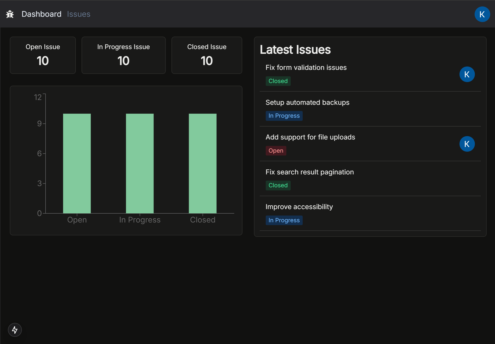
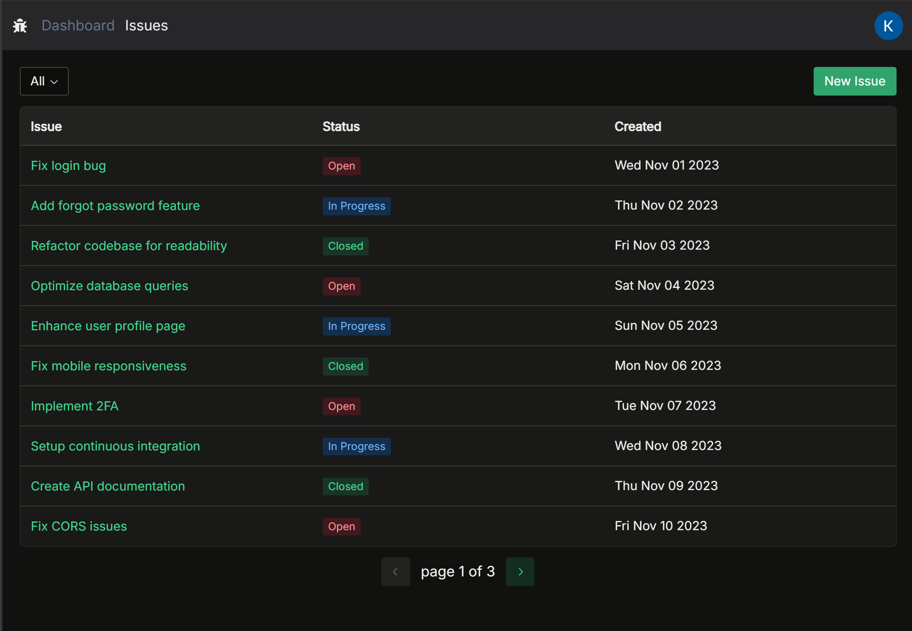

<h1 align="center">Issue Tracker</h1>

## 📖 Description
> This Project is create Issue Tracker website. The project have dashboard page for display information of Issues data and Issue page that list all issue. User can login with Goolge account to create and edit new issue.

## 🌐 Visit Website
URL: https://issue-tracker-app-tnantakis-projects.vercel.app/

## Previews
|  <br> <center>**Dashboard Page**</center> |  <br> <center>**Issues Page**</center> |
| :-: | :-: |

## 🧰 Built with
[](https://skillicons.dev)

## 📝 Usage
### Requirement
This project use `Node.js` with `TypsScript` to compile source code

1. Create `.env` file by provide the variable as `.env.example`.

2. Install dependency modules.
```shell
npm i
```

3. Build files
```shell
npm run build
```

### Running Server
```shell
npm start
```

## 📋 Reference
This project is build by learning from the Next.js Projects: Build an Issue Tracker course by Mosh Hamedani. You can find the full course at: https://codewithmosh.com

## 📈 Progress
- [x] Create NavBar Component & adjust Layout page
- [x] Style Active navbar
- [x] Install Prisma & Create Issue model
- [x] Build API to create issue
- [x] Create NewIssuePage
- [x] Customize Redix-UI Theme & Font
- [x] Handle Issue Form submit
- [x] Display Error messages
- [x] Build Spinner component
- [x] Create Table for display issues
- [x] Build Issued status component
- [x] Build Issue Table Skeleton component
- [x] Create Issue Detail Page
- [x] Build Link component
- [x] Apply loading page to NewIssue page & IssueDetail page
- [x] Organize Import statement
- [x] Add Edit Issue button
- [x] Apply Single Reponsibility Principle to Issue Detail page
- [x] Build Edit Issue Page
- [x] Create API for update Issue
- [x] Update Issue Form: Apply update API
- [x] Add Delete button
- [x] Add show confirmation dialog
- [x] Create API delete Issue & apply to delete button
- [x] Setting Google OAuth & Add Prisma User models
- [x] Add Login & Logout Link
- [x] Change the Layout of the navbar
- [x] Create drop-down menu to show the current user
- [x] Reactor the navbar
- [x] Secure Application
- [ ] Secure API route
- [x] Build AssignSelect component
- [x] Create User API & Populate AssignSelect component
- [x] Fetch Users data with React Query
- [x] Update Issue schema & API patch Issue
- [x] Apply patch Issue to AssignSelection
- [x] Show toast notification
- [x] Build the status filter component
- [x] Apply Filter Issue
- [x] Make Issue column sortable
- [x] Create Pagination component
- [x] Build the latest Issue component
- [x] Build The Issue Summary component
- [x] Build the Issue Chart component
- [x] Layout dashboard page
- [x] Add metadata of each page
- [x] Optimize performance using react cache